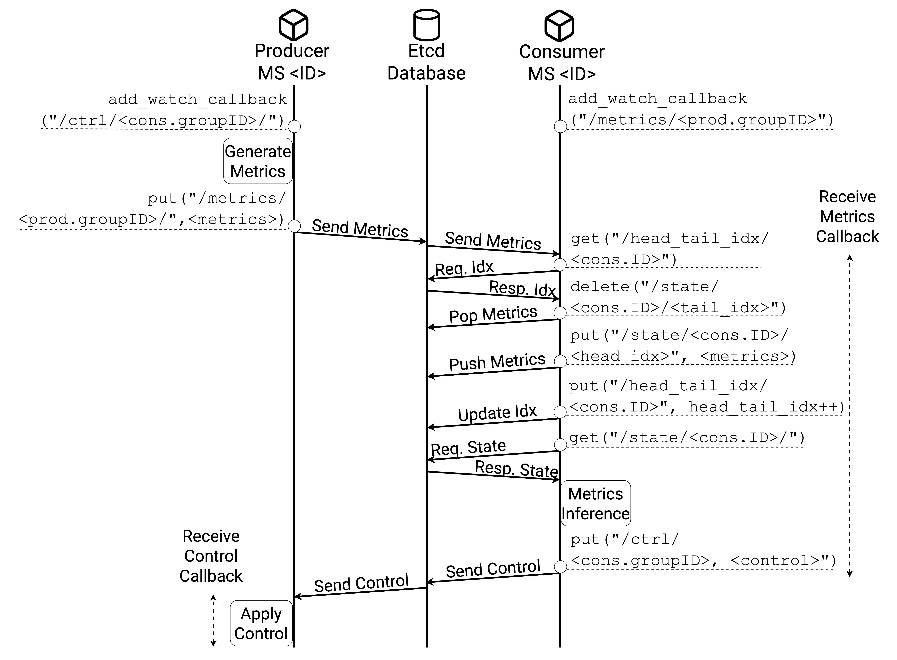

# Producer And Consumer Emulator (PACE)
This repository contains Producer And Consumer Emulator (PACE), a novel emulator of Network Performance Metrics (NPMs) producers and consumers, all implemented as microservices, which captures a wide range of interaction patterns and computing load dynamics. In our paper: A. Calagna, S. Ravera and C. F. Chiasserini, "Enabling Efficient Collection and Usage of Network Performance Metrics at the Edge," Computer Networks, 2025, we use PACE on our cloud computing testbed, to conduct a thorough characterization of various NPM platform architectures and implementations under a spectrum of realistic edge traffic scenarios, from loosely coupled control loops to latency- and mission- critical use cases.

*Please cite the paper if you plan to use PACE in your publication.*

---

PACE emulates $P$ producers and $C$ consumers, all implemented as microservices and operating in configurable, arbitrarily paired groups. Each producer can be individually configured in terms of metrics generation period and size, i.e., how frequently and how large the values of the metrics are produced. Upon receiving such metrics, consumers can process them, generate a control message with tunable size, and update their own internal state accordingly. Each consumer's state is implemented with a queue of customizable length and it is uniquely identifiable by the consumer's ID. Also, to create groups of producers and consumers communicating independently from each other and with different settings, a group ID is assigned to both producers and consumers. To seamlessly integrate PACE with etcd and Redis database technologies, we designed it to leverage the etcd and Redis data types and interfaces. By adjusting the rate of data production and the number of concurrent producer(s)-consumer(s) groups, our emulator is able to encompass different scales of edge networks, from moderate to high-traffic conditions.

Etcd APIs                  |  Redis APIs
:-------------------------:|:-------------------------:
  |  

Diagrams above illustrate the flow between a producer microservice and a consumer microservice, and the NPM platform interfaces they use to interact and to update their internal state. We consider NPM platform implementation based on popular, off-the-shelf distributed database technologies, i.e., [etcd](https://github.com/etcd-io/etcd), for prioritizing consistency over availability, and [Redis](https://github.com/redis/redis), for prioritizing availability over consistency.

---

We implemented PACE using Python language and mainly leveraged [etcd-](https://github.com/kragniz/python-etcd3) and [redis-](https://github.com/grokzen/redis-py-cluster) Python APIs to perform data operations and callback routines. We containerized both versions of PACE starting from the ubuntu:22.10 base image and installing the required libraries. Then, we used the attached YAMLs to run PACE as Kubernetes Pods.
